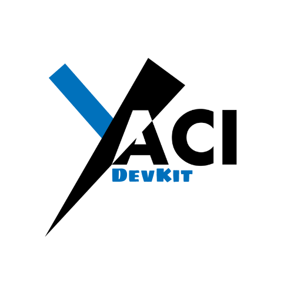

<div align="center">


<h1>Yaci DevKit</h1>
<h4>Complete Cardano development environment with instant local devnet</h4>

[](https://github.com/bloxbean/yaci-devkit/releases)
[](https://hub.docker.com/r/bloxbean/yaci-devkit)
[](LICENSE)

</div>

## 🚀 What is Yaci DevKit?

**Yaci DevKit** is a comprehensive Cardano development toolkit that provides developers with a complete local blockchain environment. Create, customize, and manage your own Cardano devnet in seconds, enabling rapid development and testing of DApps, smart contracts, and blockchain integrations.

### ✨ Key Features

- **⚡ Instant Devnet Creation** - Launch a complete Cardano network in seconds
- **🎛️ Flexible Configuration** - Customize block times, epochs, eras, and network parameters
- **🔄 Rollback Testing** - Advanced rollback simulation for robust application testing *(New in v0.11.0-beta1)*
- **⏱️ Sub-second Block Times** - Support for ultra-fast development with 200ms block times *(New in v0.11.0-beta1)*
- **🌐 Multi-node Support** - Enable multiple nodes specifically for rollback testing scenarios
- **📊 Built-in Indexer** - Integrated Yaci Store with Blockfrost-compatible APIs
- **🎯 Developer Tools** - Browser-based viewer, CLI management, and extensive APIs
- **🔗 SDK Integration** - Seamless integration with popular Cardano SDKs (Mesh, CCL, Lucid Evolution)

## 🏗️ Architecture

### Standard Single-node Setup (Default)
For most development scenarios, Yaci DevKit runs a single Cardano node:

```
┌─────────────────┐  ┌─────────────────┐  ┌─────────────────┐
│   Yaci Viewer   │  │   Your DApp     │  │   Yaci CLI      │
│  (Web UI)       │  │  (Frontend)     │  │  (Management)   │
└─────────────────┘  └─────────────────┘  └─────────────────┘
         │                     │                     │
         └─────────────────────┼─────────────────────┘
                               │
┌─────────────────────────────────────────────────────────────┐
│                     API Layer                              │
│  ┌─────────────┐  ┌─────────────┐  ┌─────────────┐        │
│  │ Yaci Store  │  │   Ogmios    │  │    Kupo     │        │
│  │ (Indexer)   │  │ (Optional)  │  │ (Optional)  │        │
│  └─────────────┘  └─────────────┘  └─────────────┘        │
└─────────────────────────────────────────────────────────────┘
                               │
┌─────────────────────────────────────────────────────────────┐
│                 Single Cardano Node                       │
│            ┌─────────────────────┐                        │
│            │      Node 1         │                        │
│            │    (Producer)       │                        │
│            └─────────────────────┘                        │
└─────────────────────────────────────────────────────────────┘
```

### Multi-node Setup (Rollback Testing Only)
When `--enable-multi-node` is used, DevKit creates a 3-node cluster for rollback testing:

```
┌─────────────────────────────────────────────────────────────┐
│              Multi-node Cluster                            │
│  ┌─────────────┐  ┌─────────────┐  ┌─────────────┐        │
│  │   Node 1    │  │   Node 2    │  │   Node 3    │        │
│  │ (Producer)  │  │ (Producer)  │  │  (Producer) │        │
│  └─────────────┘  └─────────────┘  └─────────────┘        │
└─────────────────────────────────────────────────────────────┘
```

## 📋 Current Releases

🚀 **Latest Stable Release**: **[v0.10.6](https://github.com/bloxbean/yaci-devkit/releases/tag/v0.10.6)**

🧪 **Latest Beta Release**: **[v0.11.0-beta1](https://github.com/bloxbean/yaci-devkit/releases/tag/v0.11.0-beta1)**

## 📦 Components

| Component | Description | Default Port                         |
|-----------|-------------|--------------------------------------|
| **[Yaci CLI](./applications/cli)** | Command-line interface for devnet management | -                                    |
| **[Yaci Store](https://github.com/bloxbean/yaci-store)** | Lightweight indexer with Blockfrost-compatible APIs | 8080                                 |
| **[Yaci Viewer](./applications/viewer)** | Web-based blockchain explorer for developers | 5173                                 |
| **Cardano Node** | Official Cardano node (supports both amd64/arm64) | 3001 (n2n), 3333 (n2c through socat) |
| **[Ogmios](https://ogmios.dev/)** | WebSocket API for Cardano (optional) | 1337                                 |
| **[Kupo](https://cardanosolutions.github.io/kupo/)** | Chain indexer focusing on patterns (optional) | 1442                                 |

## 🎯 Quick Start

### Prerequisites

- **Docker** and **Docker Compose** for Docker based distribution

### Installation

Yaci DevKit offers multiple distribution options to fit your development workflow:

#### Option 1: Zip Distribution (Local Development)
Perfect for local development and testing:
```bash
# Download latest release
wget https://github.com/bloxbean/yaci-devkit/releases/latest/download/yaci-devkit.zip
unzip yaci-devkit.zip
cd yaci-devkit
./bin/devkit.sh start
```

#### Option 2: Docker Distribution  
For containerized environments:
```bash
# Pull and run with docker-compose
git clone https://github.com/bloxbean/yaci-devkit.git
cd yaci-devkit
docker-compose up -d
```

#### Option 3: NPM Distribution (CI/CD Ready)
🚀 **Perfect for CI/CD pipelines and automated testing:**
```bash
# Global installation
npm install -g @bloxbean/yaci-devkit
yaci-devkit up --enable-yaci-store
or
yaci-devkit up --enable-kupomios
```

**CI Integration Examples:**
- ✅ **GitHub Actions** - Automated testing with DevKit

[📖 **CI Integration Guide**](https://devkit.yaci.xyz/ci-integration) | [🔗 **Sample CI Project**](https://github.com/bloxbean/devkit-npm-ci-test)

### Start Your First Devnet

```bash
# Start DevKit
./bin/devkit.sh start

# Create and start a single-node devnet (default)
yaci-cli> create-node -o --start
```

🎉 **That's it!** Your devnet is now running with:
- **Yaci Viewer**: http://localhost:5173
- **API Docs**: http://localhost:8080/swagger-ui/index.html
- **Yaci Store API**: http://localhost:8080/api/v1/

## 🎛️ Configuration Options

### Standard Development
```bash
# Default single-node setup (1 second blocks)
create-node -o --start

# High-speed development (200ms blocks) - New in v0.11.0-beta1
create-node --block-time 0.2 --slot-length 0.2 -o --start
```

### Rollback Testing (Multi-node)
```bash
# Enable multi-node ONLY for rollback testing
create-node --enable-multi-node --block-time 2 -o --start

# Simulate network partition for rollback testing
devnet:default> create-forks

# Submit transactions during fork...
devnet:default> topup addr_test1... 1000

# Trigger consensus-based rollback
devnet:default> join-forks
```

> **Note**: Multi-node setup is specifically designed for rollback testing scenarios. For regular development, use the standard single-node setup which is faster and uses fewer resources.

## 🔧 Development Workflow

### 1. Fund Test Addresses
```bash
# Auto-fund addresses on startup (config/env)
topup_addresses=addr_test1...:20000,addr_test1...:10000

# Or fund manually
devnet:default> topup addr_test1qzx... 50000

# Use default test addresses (always available)
devnet:default> default-addresses
```

### 2. Monitor Network State
```bash
# Check current tip
devnet:default> tip

# View UTXOs at address
devnet:default> utxos addr_test1...

# Get network info
devnet:default> info
```

### 3. Reset and Iterate
```bash
# Quick reset without losing configuration
devnet:default> reset

# Full cleanup
./bin/devkit.sh stop
./bin/devkit.sh start
```

## 🔗 SDK Integration

### Blockfrost Provider (Mesh, Lucid Evolution)
```javascript
// JavaScript/TypeScript
const blockfrost = new BlockfrostProvider({
  projectId: 'your-project-id', // Not required for local devnet
  baseUrl: 'http://localhost:8080/api/v1'
});
```

### Cardano Client Lib (Java)
```java
// Java
BackendService backendService = new BFBackendService(
  "http://localhost:8080/api/v1/", 
  "your-project-id" // Not required for local devnet
);
```

## 🧪 Testing Features

### Rollback Testing (v0.11.0-beta1+)
Test your applications against realistic rollback scenarios using multi-node setup:

1. **Consensus-based Rollbacks** - Real network partitions using `create-forks`/`join-forks`
2. **Database Snapshots** - Quick state restoration using `set-rollback-point`/`rollback`

[→ Complete Rollback Testing Guide](https://devkit.yaci.xyz/rollback-testing)

### Performance Testing
- **Sub-second blocks** for high-throughput testing (0.2s blocks)
- **Custom epoch lengths** for delegation/rewards testing
- **Predictable block times** for reliable testing scenarios

## 📚 Documentation

| Resource | Description |
|----------|-------------|
| **[Official Documentation](https://devkit.yaci.xyz/)** | Complete guides and API reference |
| **[Rollback Testing Guide](https://devkit.yaci.xyz/rollback-testing)** | Advanced rollback simulation |
| **[Mesh SDK Integration](https://meshjs.dev/yaci/getting-started)** | JavaScript/TypeScript development |
| **[CLI Commands Reference](https://devkit.yaci.xyz/commands)** | All available commands |

## 🎬 Video Tutorials

| Tutorial | Description |
|----------|-------------|
| [](https://www.youtube.com/watch?v=rfwTuKXtqzg) | **Yaci Viewer with Local Devnet and Cardano Client Lib Demo** |
| [](https://www.youtube.com/watch?v=PTnSc85t0Nk) | **Test Aiken Smart Contract Using Java Offchain Code** |

## 🛠️ Development

### Build from Source
```bash
# Using Earthly (recommended)
earthly --arg-file-path=config/version +build

# Manual build
cd applications/cli && ./gradlew clean build
cd applications/viewer && npm install && npm run build
```

### Requirements
- **Java 21** (for Yaci CLI)
- **Node.js 18+** (for Yaci Viewer)
- **Earthly** (for unified builds)

## 🤝 Community & Support

- **📝 [GitHub Discussions](https://github.com/bloxbean/yaci-devkit/discussions)** - Questions and ideas
- **🐛 [GitHub Issues](https://github.com/bloxbean/yaci-devkit/issues)** - Bug reports and feature requests  
- **💬 [Discord Server](https://discord.gg/JtQ54MSw6p)** - Real-time community support
- **📖 [Documentation](https://devkit.yaci.xyz/)** - Comprehensive guides

## 📈 Why Choose Yaci DevKit?

| Traditional Development | With Yaci DevKit |
|------------------------|-------------------|
| ⏳ Wait for testnet transactions | ⚡ Instant local transactions |
| 🌐 Depend on external testnets | 🔒 Fully controlled environment |
| 🐌 Slow iteration cycles | 🚀 Rapid development loops |
| 🔄 Manual rollback testing | 🎯 Automated rollback scenarios |
| 📊 Limited debugging tools | 🛠️ Rich developer tooling |

## 📄 License

This project is licensed under the **MIT License** - see the [LICENSE](LICENSE) file for details.

---

<div align="center">

**⭐ Star this repo if Yaci DevKit helps accelerate your Cardano development!**

[Documentation](https://devkit.yaci.xyz/) • [Discord](https://discord.gg/JtQ54MSw6p)

</div>
